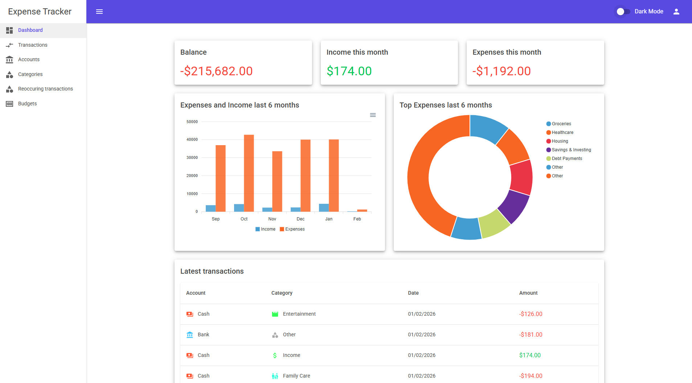
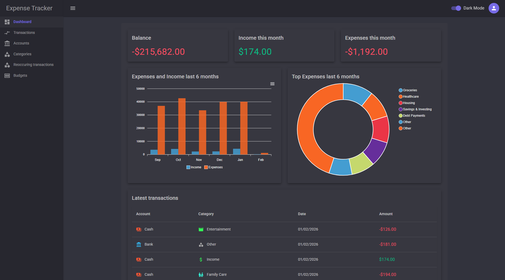
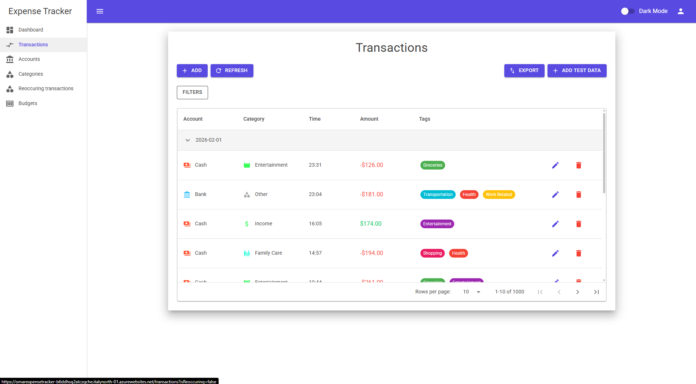

## Expense Tracker
A simple expense tracking app with dashboard, transactions, accounts, categories, dark mode, and CSV export.


#### Features
- Dashboard with quick stats and graphs
- Transaction list with filtering, editing, and CSV export
- Customizable accounts, categories and budgets
- Dark mode


#### Live Demo
Check out the live demo here: [expensetracker.net](https://omarexpensetracker-b6ddhsg2atczgche.italynorth-01.azurewebsites.net/)

**Demo Login (no registration needed)**  
Email: `sa`  
Password: `Secret1!`

#### Screenshots 






#### Tech Stack
- Blazor WebAssembly (with prerendering)
- ASP.NET Core Web API
- SQLite + EF Core
- ASP.NET Identity + JWT Authentication
- MudBlazor
- ApexCharts


#### Running with Docker
To run the app inside a Docker container:

1. Clone the repository:
```bash
   git clone git@github.com:omarkurtovic/ExpenseTracker.git
   cd ExpenseTracker
```

2. Start the application:
```bash
   docker-compose up
```

3. Open your browser and navigate to: **http://localhost:8080**

To stop the application:
```bash
docker-compose down
```